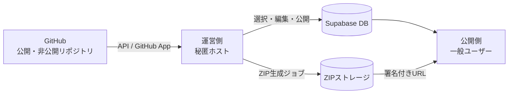
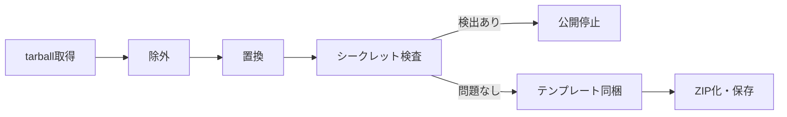

# リポジトリショーケース 仕様書（フェーズ1 MVP）

最終更新: 2026-09-22

## 概要

GitHubを非公開の倉庫にし、運営が選んだリポジトリだけを、履歴とAIの痕跡を消したスナップショットとして公開・ZIP配布するプラットフォームです。フェーズ1は運営者1人の棚として動かし、機能は「データベース＋ダウンロード」に絞ります。

- **目的**：自作ツールを、アカウント名やAIの痕跡を出さずに共有する。ダウンロード時のメール登録でリストも獲得する
- **ターゲット**：非エンジニアだが、Claude CodeやCursorなどのAIエディターは使える人
- **フェーズ1の範囲**：リポジトリの取り込みと選択、公開ページ、マスク済みZIPの生成と配布、セットアップテンプレートの同梱
- **フェーズ1でやらないこと**：販売・決済、コードの実行やライブデモのホスティング、他の出品者の受け入れ
- **設計方針**：データは最初から出品者ID付きのマルチテナント前提で持ち、画面と運用だけを段階的に開放する

## 全体構成とURL設計

公開側と運営側は別ホストに分け、運営側のURLには `admin` や `dashboard` など推測しやすい語を使いません。ただしURLを隠すことは補助にすぎないため、認証と許可リストを必ず併用します。



GitHubの内容は運営側を通った後でしか外に出ません。公開側はDBとストレージを読むだけで、GitHubには一切アクセスしません。

| 区分 | URLの例 | アクセス制御 |
| --- | --- | --- |
| 公開側 | `example.com`、`example.com/r/<slug>` | 誰でも閲覧可。ダウンロード時にメール登録 |
| 運営側 | `<ランダム英数字>.example.com`、またはパスを環境変数 `OPS_BASE_PATH` で指定 | Supabase Auth＋許可リストのメールのみ＋二要素認証 |

運営側の追加ルールは次のとおりです。

- 未認証のアクセスには、ログイン画面ではなく404を返す（入口の存在を知らせない）
- `noindex` とrobots.txtで検索エンジンに載せない。公開側からリンクしない
- 運営側のホスト名とパスは環境変数で管理し、コードやリポジトリにハードコードしない
- ログインの試行回数を制限し、ログイン履歴を記録する

## 機能一覧

フェーズ1の機能は、運営側が6つ、公開側が4つです。デモは画像とGIF・動画のアップロードだけで、コードの読み取りや実行は行いません。

### 運営側

| 機能 | 内容 |
| --- | --- |
| GitHub連携 | パブリックはユーザー名だけで取得。プライベートはGitHub Appをインストールし、対象リポジトリを選んでもらう |
| リポジトリ一覧・選択 | 取り込んだリポジトリを一覧表示し、公開するものにチェックを付ける |
| 公開ページ編集 | タイトル、概要、機能タグ、ヒーロー画像、デモGIF・動画を登録する |
| セットアップ設定 | 必要な環境、セットアップと起動のコマンド、env変数（キー名・説明・取得先）を入力する |
| マスク設定 | 除外パスと置換ルールを、全体共通とリポジトリ個別の2層で設定する |
| スナップショット公開 | ZIPを生成し、検出結果（置換件数、シークレットの疑い）を確認してから公開する。push後も自動では再公開しない |

### 公開側

| 機能 | 内容 |
| --- | --- |
| 一覧 | カード形式で、ヒーロー画像、タイトル、一行概要、タグを表示する |
| 詳細ページ | 概要、デモ（GIF・動画）、機能、必要な環境、セットアップの流れを表示する。ファイルの中身は表示しない |
| ダウンロード | メールアドレスを登録すると、有効期限付きの署名付きURLでZIPを配布する |
| 通報 | 問題のある内容を運営に知らせるフォーム |

## マスク・ZIP生成パイプライン

ZIPはGitHub標準のものを使わず、毎回サーバー側で作り直します。標準のZIPはルートフォルダ名が `owner-repo-sha/` となり、アカウント名が漏れるためです。



1. **取得**：GitHub APIで特定コミットのtarballを取得する。`.git` を含まないため、コミット履歴や `Co-Authored-By` はこの時点で消える
2. **除外**：次のパスを取り除く。既定の対象は `.git/`、`.github/`、`.claude/`、`.cursor/`、`CLAUDE.md`、`AGENTS.md`、`.env`、`.env.*`（`.env.example` は除く）、`node_modules/`、実行ファイル・バイナリ
3. **置換**：テキストファイルのみを対象に、置換ルールを適用する。例：GitHubのユーザー名とメールアドレス → 表示名、`package.json` の `author`・`repository`・`bugs`・`homepage` の削除、READMEのGitHubバッジとリンクの削除
4. **検査**：シークレットスキャン（gitleaksやsecretlint相当）と、置換漏れのチェック（登録済みのNGワードが残っていないか）を行う。1件でも検出されれば公開を停止し、運営側に表示する
5. **同梱**：セットアップテンプレート（次のセクション）を生成してルートに追加する
6. **保存**：ルートフォルダ名を `<公開slug>/` にしてZIP化し、ストレージに保存する。ファイル名は `<slug>-v<版数>.zip` とする

NGワードの初期値には、自分のGitHubユーザー名、個人のメールアドレス、`claude`、`anthropic`、`cursor`、`copilot`、`noreply` を登録しておきます。ただし `claude` などは、コードの正当な用途（APIの呼び出しなど）でも出てくるため、置換はせずに検出して確認するだけにします。

## セットアップテンプレート

運営側で入力したセットアップ設定から、4つのファイルを自動生成してZIPのルートに同梱します。設定はDBに保存し、元リポジトリには何も追加しません。

| 生成ファイル | 中身 |
| --- | --- |
| `SETUP.md` | 非エンジニア向けの手順。必要な環境、インストール、env設定、起動、よくあるエラー |
| `.env.example` | キー名、必須かどうか、説明、取得先URLをコメント付きで記載。値は空欄 |
| `setup.sh` / `setup.ps1` | Mac・Linux用とWindows用。環境の確認、`.env` のコピー、依存関係のインストールまでを行う |
| `AI_SETUP_PROMPT.md` | AIエディターに貼るだけでセットアップを代行させるためのプロンプト |

セットアップ設定の項目は次のとおりです（運営側の入力フォームとDBのJSONに対応します）。

```yaml
requirements:        # 必要な環境
  - Node.js 20以上
setup: npm install   # セットアップコマンド
start: npm run dev   # 起動コマンド
open_url: http://localhost:3000
env:
  - key: OPENAI_API_KEY
    required: true
    description: OpenAIのAPIキー
    how_to_get: https://platform.openai.com/api-keys
```

`AI_SETUP_PROMPT.md` の本文は、次の雛形に設定値を差し込んで作ります。

```markdown
このフォルダのプロジェクトをローカルで動かしたいです。
SETUP.md と .env.example を読んで、次の順に進めてください。
1. 必要な環境（Node.js 20以上）が入っているか確認し、なければ入れ方を教えてください
2. .env.example を .env にコピーしてください
3. 各キーの取得方法を1つずつ案内し、私が値を入力するのを待ってください
4. npm install を実行し、npm run dev で起動してください
5. http://localhost:3000 が開けたら完了です。エラーが出たら原因と対処を説明してください
APIキーの値は、チャットに書き出したり外部に送信したりしないでください。
```

## データモデル

テーブルは7つです（閲覧制限とセットアップの4つは表の末尾に追記）。すべての主要テーブルに `creator_id` を持たせ、SupabaseのRow Level Securityで出品者ごとに分離します。フェーズ1では出品者は1人ですが、将来の追加時にテーブル構成を変えずに済みます。

| テーブル | 主な列 | 備考 |
| --- | --- | --- |
| `creators` | id, display_name, github_login, github_installation_id | 出品者。github_loginは非公開 |
| `repos` | id, creator_id, github_repo_id, full_name, visibility, default_branch | GitHubから取り込んだ全リポジトリ |
| `listings` | id, creator_id, repo_id, slug, title, summary, tags, hero_image, demo_media, setup_config (JSON), status | 公開ページ。statusは下書き・公開・非公開 |
| `mask_rules` | id, creator_id, listing_id (NULLなら全体共通), kind, pattern, replacement | kindは除外・置換・NGワード |
| `snapshots` | id, listing_id, commit_sha, version, zip_path, scan_report (JSON), status | 生成したZIPの版。公開中の版は1つ |
| `downloads` | id, snapshot_id, email, consent_newsletter, created_at | ダウンロードとメール登録の記録 |
| `reports` | id, listing_id, reason, body, status | 通報 |
| `site_settings` | id, creator_id, access_mode, verify_email | 公開側の閲覧制限（誰でも・メール登録制・登録済みのみ） |
| `viewers` | id, creator_id, email, status, source, note, last_login_at | 公開側を見られるメールアドレス |
| `access_codes` | id, email, code_hash, expires_at, attempts, consumed_at | メールで送った確認コード（ハッシュのみ保存） |
| `app_config` | id, creator_id, entries (JSON) | セットアップ画面の設定。APIキーなどは AES-256-GCM で暗号化して保存 |

閲覧制限とセットアップの4テーブルは後から追加したもので、読み書きはサーバー側（サービスロールキー）からだけ行います。

公開側から読めるのは、statusが公開の `listings` と、公開中の `snapshots` の表示用の列だけにします。`creators.github_login`、`repos.full_name`、`commit_sha` は公開側のAPIでは返しません。

## 技術スタックとセキュリティ

構成はNext.js＋Vercel、Supabase、Cloudflare R2を軸にします。「コードを実行しない、シークレットを預からない」ことで、維持費と攻撃面を小さく保ちます。

| 領域 | 採用 | 理由 |
| --- | --- | --- |
| フロント・API | Next.js（App Router）＋Vercel | 公開側と運営側を別プロジェクトにしてデプロイ先を分ける |
| DB・認証 | Supabase（Postgres、Auth、RLS） | 出品者ごとの分離をRLSで担保できる |
| ZIP・画像・動画 | Cloudflare R2 | 転送料がかからず、ダウンロード配布と相性がいい |
| GitHub連携 | GitHub App＋Octokit | 権限を「Contents: 読み取り」と「Metadata: 読み取り」だけに絞る |
| ZIP生成ジョブ | Inngest、Trigger.dev、Supabase Edge Functionsのいずれか | Vercel関数の実行時間の制限を避ける |
| 検査 | gitleaks相当のルール＋自前のNGワード照合 | ジョブ内で実行する |

セキュリティの要件は次のとおりです。

- GitHub Appの秘密鍵とトークンは、運営側とジョブの環境変数にだけ置く。公開側には渡さない
- ZIPの署名付きURLは有効期限を短くする（目安は10分）。同じメールアドレスからの連続ダウンロードに回数制限をかける
- アップロードする画像・動画は、形式とサイズを制限する。SVGは受け付けない（スクリプトが埋め込めるため）
- 利用規約に、公開内容の責任は出品者にあること、マスクと検査は補助機能であることを明記する
- メール登録の画面に、ニュースレター配信への同意のチェックボックスを置く（未チェックが初期値）

料金体系は変わるため、各サービスのプランは実装時に確認します。

## 対象外と未決事項

フェーズ1では販売、実行型デモ、複数出品者を扱いません。ただし、ダウンロードの手前に権限チェックの層を1つ挟んでおき、後から課金を差し込めるようにします。

**フェーズ2以降に回すもの**

- 販売・決済（Stripe Connect）と出品者向けの有料プラン
- 招待制の出品者追加、通報への対応フロー
- READMEから概要と機能タグを下書きするAI生成
- アクセス解析、独自ドメイン

**未決事項**

- [ ] サービス名とドメイン
- [ ] 運営側URLを、ランダムなサブドメインにするか、秘匿パスにするか
- [ ] ZIP生成ジョブの実行基盤（Inngest、Trigger.dev、Supabase Edge Functions）
- [ ] メール登録のリストを、既存のニュースレターにどう連携するか
- [ ] 利用規約とプライバシーポリシーの文面
